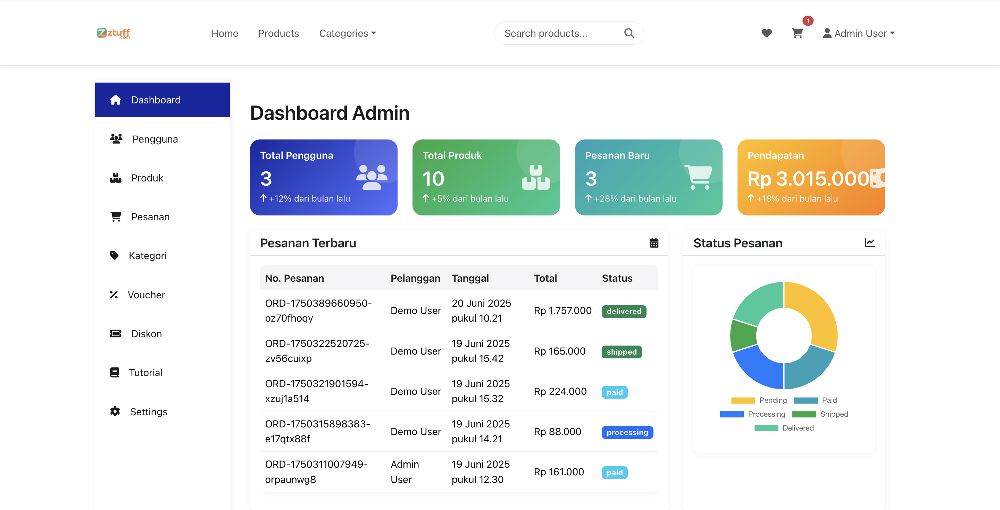
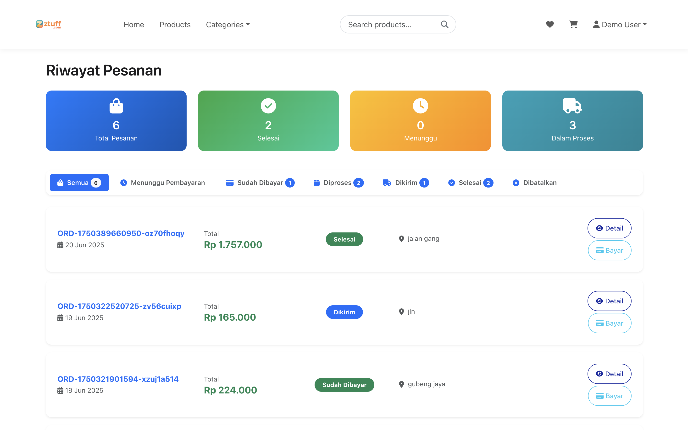

# ztuff E-commerce Platform

A full-stack e-commerce platform built with React frontend and Node.js backend, featuring comprehensive dropshipping capabilities.

## Screenshots

### Admin Dashboard


### User Interface



## Project Structure

```
dropship/
├── frontend/          # React application
│   ├── src/
│   │   ├── components/    # Reusable components
│   │   ├── contexts/      # React contexts
│   │   ├── layouts/       # Layout components
│   │   └── pages/         # Page components
│   └── public/
└── backend/           # Node.js API
    ├── src/
    │   ├── controllers/   # Route handlers
    │   ├── models/        # Sequelize models
    │   ├── routes/        # API routes
    │   ├── middlewares/   # Custom middleware
    │   └── migrations/    # Database migrations
    └── uploads/          # File storage
```

## License

This project is licensed under the ISC License.